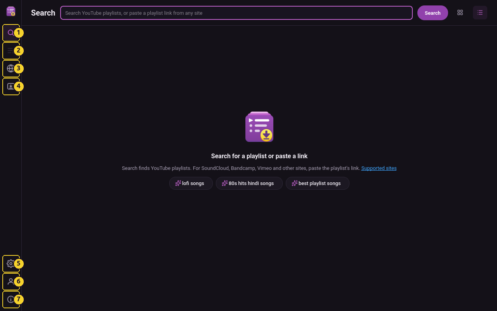
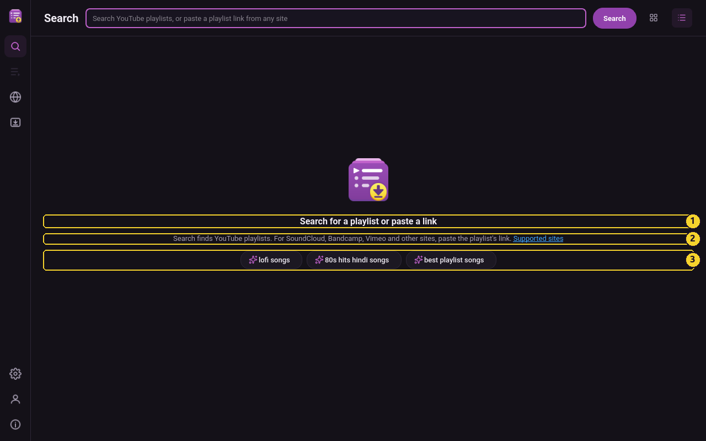
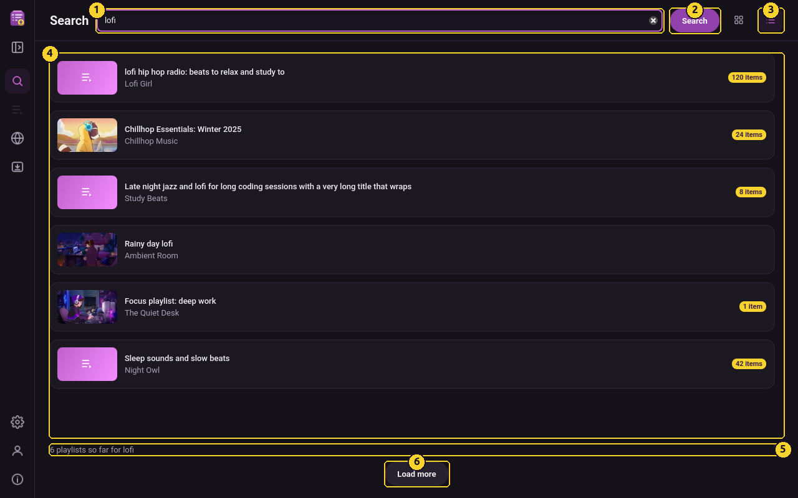
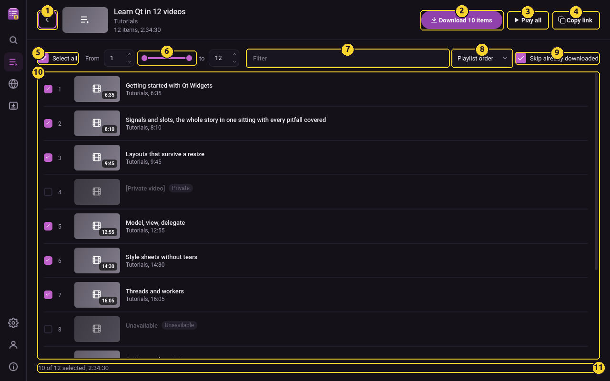
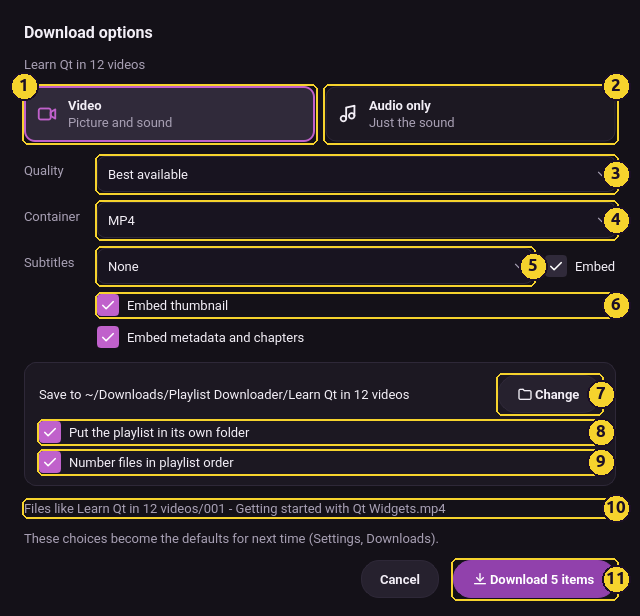
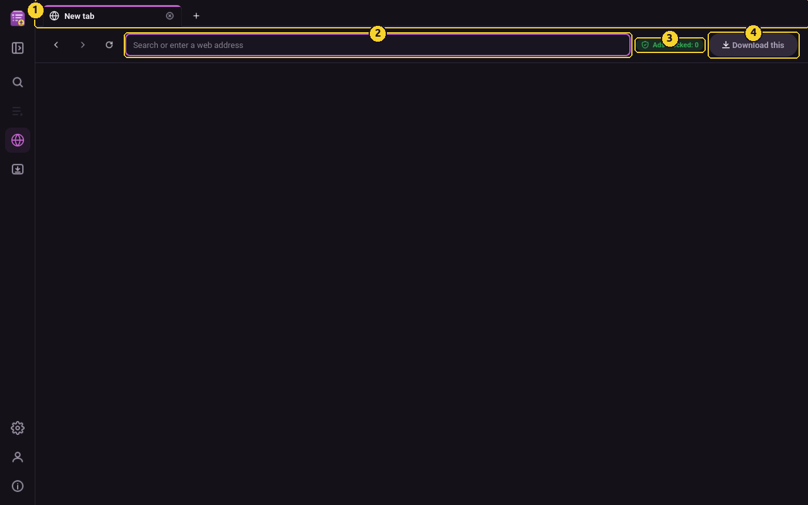
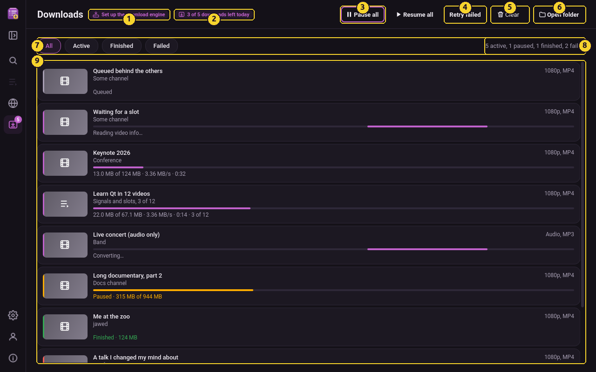
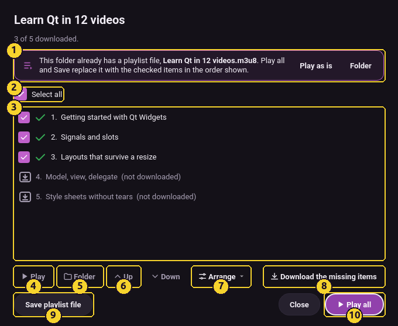
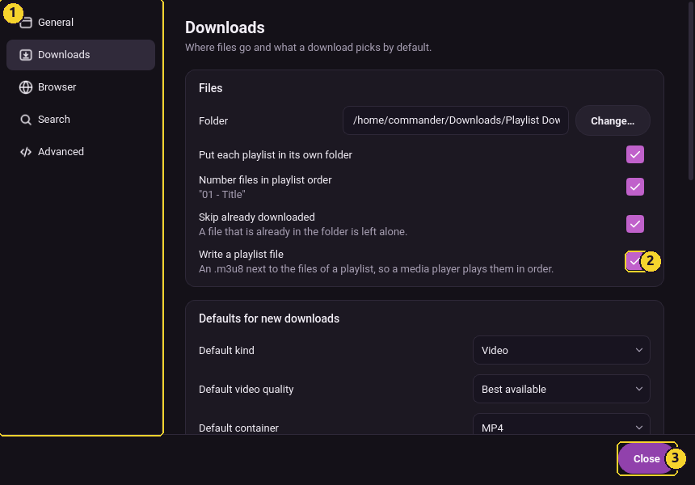

# Playlist Downloader guide

Playlist Downloader saves whole playlists offline as video or audio: search YouTube, or
paste a playlist link from any site the download engine reads (SoundCloud, Bandcamp, Vimeo
and hundreds more), then pick the items and download them. This guide walks through the
four pages of the window and the settings that matter.

## The window



1. Search, 2. Playlist, 3. Browser, 4. Downloads, 5. Settings, 6. Account, 7. Help: the
keyboard shortcuts, the online guide, the supported sites, Report a bug and About. The
button under the logo (or Ctrl+B) widens the rail to show the labels beside the icons; the
choice is remembered. Ctrl+H hides the window (to the tray when there is one, otherwise
it minimises).

A rail on the left holds the pages: **Search** (Ctrl+1), **Playlist** (Ctrl+2), **Browser**
(Ctrl+3) and **Downloads** (Ctrl+4), with **Settings** (Ctrl+,), your account and **About**
at the bottom. The info button at the very bottom opens Help: the keyboard shortcuts, the
online guide, Report a bug and About. Every action has a keyboard shortcut; the list is
the first Help entry, also on F1 or Ctrl+/.

## Search



1. Type a search or paste a link. 2. The Supported sites list. 3. Today's example searches.



1. The query. 2. Search. 3. Cards or rows. 4. The results: click a playlist to open it.
5. How many so far. 6. Load more.

Type what you are looking for and press Enter. Suggestions appear as you type (Settings, Search,
Suggest as I type); the results
are playlist cards with the number of items on each. Click a card to open the playlist.
The two buttons at the right end of the header switch between cards and a list of rows.
To start over, clear the field with its clear button, press Esc, or search with the field
empty: the results go and the start view comes back.
Recent searches come back as chips under the field (Settings, General, Keep search history).
A playlist link from any other site (a SoundCloud set, for example) opens on the Playlist page
too; a link to a single track or video opens the download options. **Supported sites** (under
the start view's note, and in the Help menu) lists every site the download engine reads, with a
filter; Open takes a site to the built-in browser.

You can also paste a link: a playlist link opens the Playlist page, a link to a single
video or track opens the download options. A link dropped anywhere on the window does the
same, and when you copy a link elsewhere and come back to the app, a small note offers to
open it.

Searches run through the download engine, so the first search on a fresh install sets it
up; the page shows the progress in place. "Load more" at the end of the results brings the
next page, and a line under the results says how many there are; Settings, Search sets how
many come at a time.

## Playlist



1. Back to Search. 2. Download the ticked items. 3. Play all in the browser. 4. Copy the
playlist's link. 5. Select all. 6. A range, from and to. 7. Filter by title. 8. Sort.
9. Skip items already downloaded. 10. The items: tick, play or download one. 11. How many
are selected and how long they run.



1. Video. 2. Audio only. 3. Quality. 4. Container. 5. Subtitles. 6. Embed the thumbnail.
7. Change the folder. 8. A folder per playlist. 9. Number files in playlist order. 10. What
the files will be called. 11. Start.

The playlist's items with their thumbnails and lengths. Tick the ones you want, use
"Select all", the From and To boxes or the slider for a range, the filter field to find a
title, and the sort menu. Videos that are private or removed are greyed out and never
downloaded. Hover a row for **Play** (opens the video on the Browser page) and **Download**
(just that video).

**Download** at the top opens the options sheet: Video or Audio only, quality and container
(MP4, MKV, WebM, up to 4K) or audio format (MP3, M4A, Opus, FLAC, WAV) and bitrate,
subtitles, embedded thumbnail and metadata, the folder (by default a folder named after
the playlist inside your download folder, files numbered in playlist order). Your choices
become the defaults for next time.

## Browser



1. Tabs. 2. The address: a site or a search. 3. Ads blocked on this page. 4. Download this.

A new tab opens empty; type an address or a search, or pick YouTube or any address as the
start page in Settings, Browser. The browser works with any website. Sign in to a site once
and your sign-in is also used for downloads from it (Settings, Downloads, Use my sign-ins),
so members-only and age-restricted videos download too.
Ads are blocked; the "Ads blocked" badge counts them. Ctrl+F finds text on the page, F11
goes full screen, Ctrl+T opens a tab, Ctrl+W closes one.

**Download this** in the toolbar downloads the video on the current page, or opens the
Playlist page when the page is a playlist. When a video is playing, a floating "Download
detected" button appears in the bottom right corner.

## Downloads



1. The download engine. 2. Today's remaining downloads on the free version. 3. Pause all.
4. Retry failed. 5. Clear finished or failed. 6. Open the download folder. 7. Filters.
8. Counts and speed. 9. The queue: hover or right-click a card for its actions; double-click
a playlist for its items.



1. A playlist file is already there. 2. Select all. 3. The items and their state. 4. Play
one. 5. Show it in the folder. 6. Move it up or down. 7. Arrange: original order, by name,
shuffle. 8. Download the missing items. 9. Save the playlist file. 10. Play all.

Every download is a card with its progress, speed and time left. A playlist is one card
that shows which item it is on. **Open** on a playlist lists its items with their state:
play one, show it in the folder, untick the ones to leave out, arrange or shuffle the order
from the **Arrange** menu, and **Play all** writes a playlist file (.m3u8) next to the files
and opens it in your media player. When the folder already has one, a notice says so with
**Play as is** to open it untouched. Items that never landed can be queued again with
**Download the missing items**. The file is also written when the playlist finishes
downloading (Settings, Downloads, Write a playlist file). Hover a card, or right-click it,
for pause or resume, cancel, retry, open, show in folder and remove; a failed card shows
why it failed, and **Retry failed** in the header starts every failed download again.
Removing a download that has files asks whether to keep them or delete them too. The
filters show active, finished or failed downloads; the Clear menu removes finished or
failed ones; Open folder opens your download folder.

On the free version a chip next to the page title counts today's remaining downloads.
You get a notification when a download finishes, with Open and Show in folder. The
download engine sets itself up on first use and keeps itself up to date; the chip next to
the page title shows its state.

## Settings



1. The pages. 2. Write a playlist file next to every downloaded playlist. 3. Close.

- **General**: the page the app starts on, light, dark or the system theme, interface
  scale, what closing does (quit or keep in the tray), search history, What's new after
  updates, notifications.
- **Downloads**: the folder, a folder per playlist, numbering, the defaults for new
  downloads, concurrent downloads, speed limit, skip already downloaded, use my
  sign-in, and the download engine card (check for updates, update, auto-update).
- **Browser**: start page (an empty tab, YouTube or an address of your own), restore tabs,
  block ads, Do Not Track, browser identity.
- **Search**: results per page.
- **Advanced**: hardware acceleration, clear cache, sign out and clear session, verbose
  logging (off unless you are reporting a problem), reset
  permissions, open the log folder, copy diagnostics, reset settings.

## Command line

```
playlist-dl <link>              open a playlist or video link in the running window
playlist-dl --download <link>   queue a download right away
playlist-dl --settings          open the settings
playlist-dl --profile <name>    run with a separate profile
playlist-dl --quit              quit the running instance
```

## Something wrong?

**What's new** beside the version in About shows this release's notes; the Version picker
reads earlier releases once there are some.

Settings, Advanced, **Copy diagnostics** puts the versions, paths and recent log lines on
the clipboard; About has a **Report a bug** button that opens an issue with them attached.
