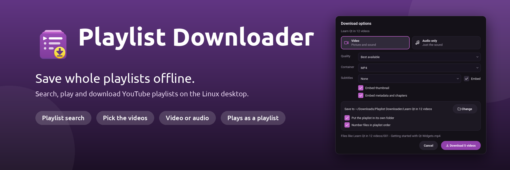
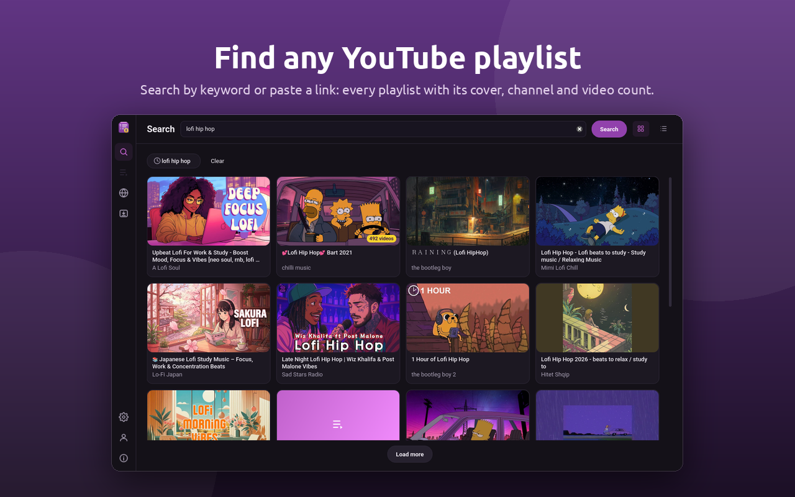
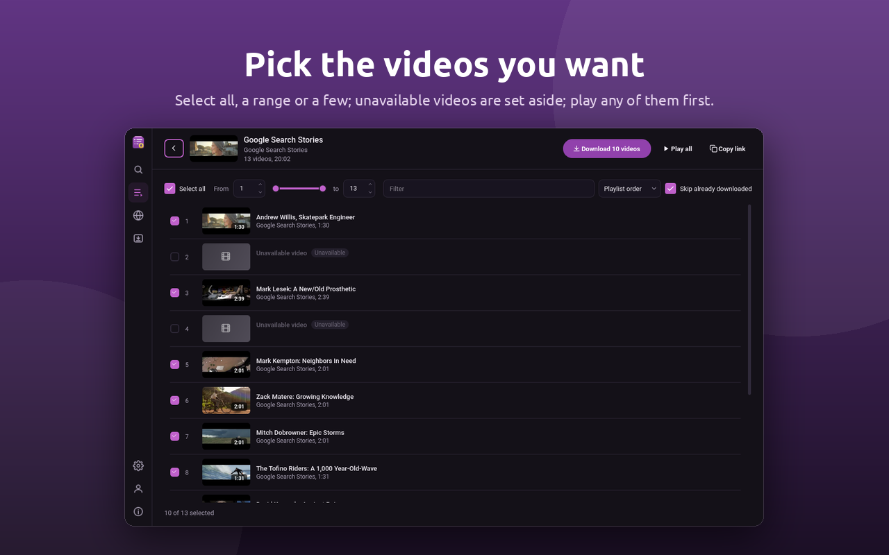
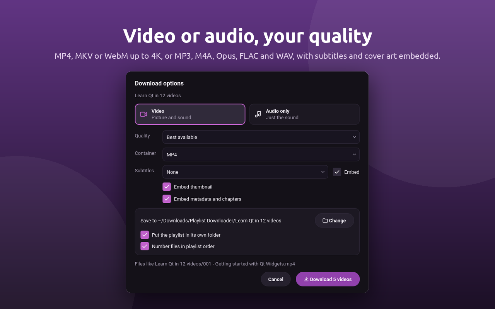
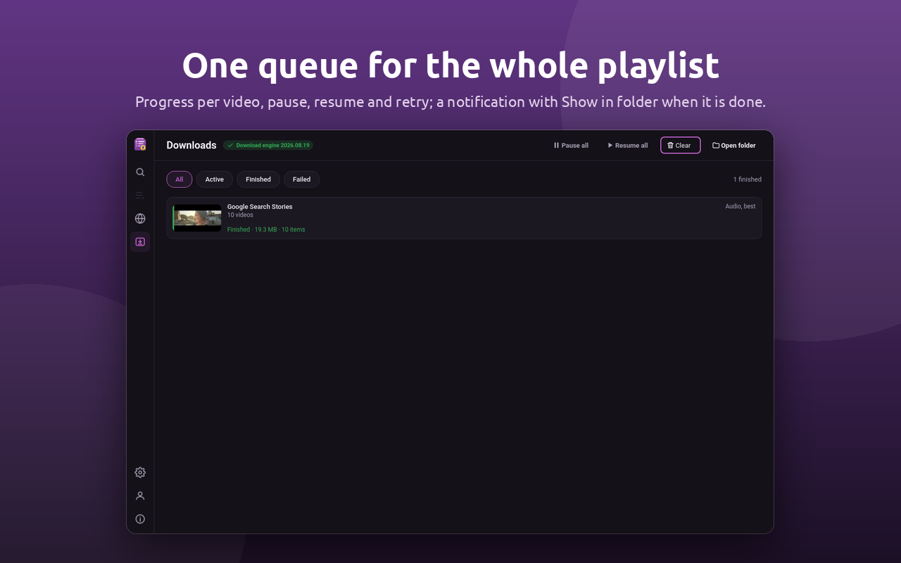
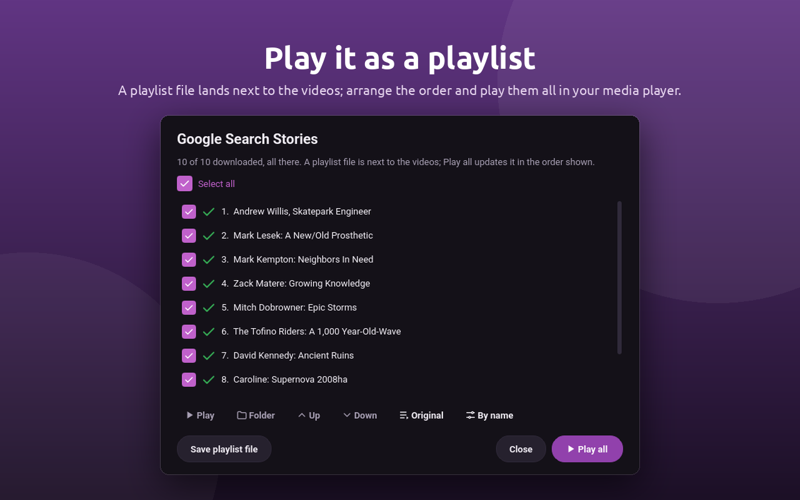

<p align="center">
  
</p>

<p align="center">
  A playlist downloader for Linux: YouTube, SoundCloud, Bandcamp, Vimeo and hundreds of
  other sites. Search or paste a link, pick the items, download the whole playlist as MP3
  or video, and play it in your media player. Native, lightweight, built with Qt&nbsp;6.
</p>

<p align="center">
  <a href="https://snapcraft.io/playlist-dl"></a>
</p>

<p align="center">
  
</p>

## Install

**Snap** (amd64 and arm64):

```sh
sudo snap install playlist-dl
```

## Features

**Find a playlist**
- Search YouTube playlists by keyword, with suggestions as you type. Every result shows its
  cover, channel and item count, as cards or a list.
- Paste a playlist link from any site the download engine reads (SoundCloud sets, Bandcamp
  albums, Vimeo showcases and many more), or a link to a single video or track.
- Browse the playlist: every item with its thumbnail and length; select all, a range or a
  few; unavailable items are set aside; play any item first.

**Download**
- MP4, MKV or WebM up to 4K, or audio only as MP3, M4A, Opus, FLAC or WAV, with subtitles,
  thumbnails and metadata embedded. Your choices become the defaults for next time.
- One queue for the whole playlist: progress per item, pause, resume, retry, a folder per
  playlist with files numbered in playlist order, and a notification with Show in folder.
- A playlist file (.m3u8) lands next to the files; open the finished playlist to arrange
  the order and play it all in your media player.
- The download engine sets itself up on first use and keeps itself updated.

**Watch**
- A built-in browser for any site: tabs, find in page, an ad blocker with a count, full
  screen, and a Download button on every page. Sign in to a site once and the sign-in is
  reused for downloads from it, so members-only and age-restricted items come too.

**Made for the desktop**
- Light and dark themes, a tray icon, taskbar progress, native Wayland and X11, a shortcuts
  sheet, single instance with `playlist-dl <link>` and `playlist-dl --download <link>`.

## Screenshots

<table>
  <tr>
    <td width="50%"></td>
    <td width="50%"></td>
  </tr>
  <tr>
    <td width="50%"></td>
    <td width="50%"></td>
  </tr>
</table>

## Building

Playlist Downloader is a Qt 6 (6.11), C++20, CMake application. On a machine with the
KDE snap runtimes:

```sh
sudo snap install kde-qt6-core24-sdk kf6-core24   # once
scripts/dev-build.sh --tests
scripts/dev-run.sh
```

`DOCS/` holds the feature contract, the design, the decisions and the progress log; start
with `DOCS/README.md`. The 2.x code (Qt 5) is on the `old-qt5` branch.

## Licence

Open source: GPL-3.0-or-later for the program, with the licensing module (account,
licence, evaluation and allowance code) under the Ktechpit Licensing Module License, which
allows reading and building it but not changing, bypassing or redistributing it. The
details, the paths and what this means for forks are in [LICENSING.md](LICENSING.md).

## Help

The [user guide](GUIDE.md) covers the window, search, playlists, downloads, the browser,
every setting, the shortcuts and common problems. Bugs and requests go to the
[issues](https://github.com/keshavbhatt/playlist-dl/issues), or by email to
[connect@ktechpit.com](mailto:connect@ktechpit.com); please attach the diagnostics from
*About, Copy* when reporting a problem.

